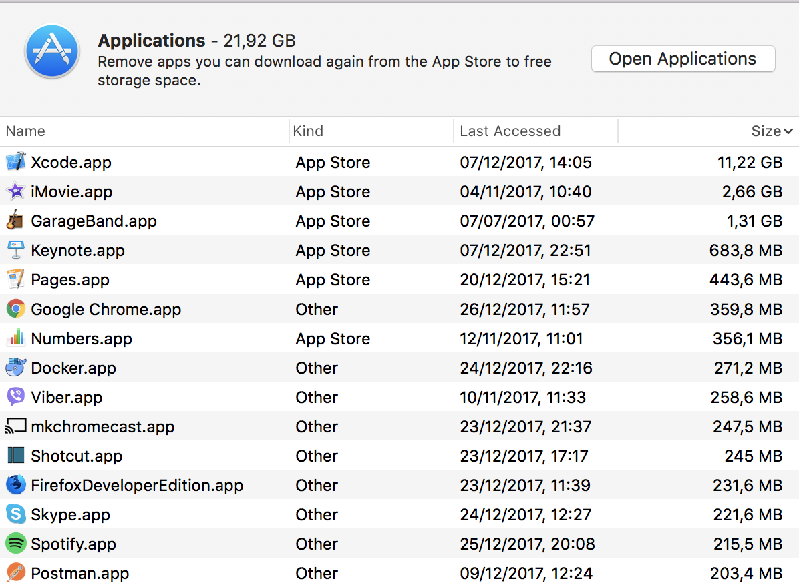

# dtfls
These are the dotfiles [I](https://twitter.com/dentuzhik) use for my personal OSX installation. Some of the things might not work on other systems and will be an overkill for you. If you think that change is generic enough, than submit an issue or (better) pull-request, I would be happy to see them.  

If you find the list of applications not suitable for you, feel free to fork the repo and adjust it the way you see fit.  
Make sure to clone the repo into the root of your home directory, I haven't tested anything with any other setup.

## Brew
Homebrew will allow you to preinstall a lot of handy software in a single command.  
But for that you will need first [manually install brew](https://brew.sh/).

* After that, go to `~/dotfiles` directory and execute `brew bundle install`
* The total size of resulted `Applications` folder with current config is around **5.4GB**, so make sure you have good internet connection  



## Safari
Copy over Safar Preferences from `./preferences` to `~/Library/Preferences`

## Alfred 
Alfred is installed using Homebrew in the previous step. Some of the alfred packages are can be found in the global npm installation (below). I manage preferences through cloud file storage, because they contain personal data. 

## Bash
For historical reasons I use Bash, and it solves 100% of my terminal usecases when configured correctly.  

Make sure you have [its latest version](http://clubmate.fi/upgrade-to-bash-4-in-mac-os-x/) used as your shell, because default installation of OSX comes with some super old Bash. You should have a good version of bash installed with Homebrew on a previous step, but make it a default shell using link above.  

## Terminal
* Install the terminal of choice, or use default OSX `Terminal.app`. I have tested these in both, they should work without significant issues.
* Go to `~/dotfiles` directory and execute `./bootstrap.sh`, this will install necessary dependencies into your system and will put the files in the right places
* You are all set!

*P.S. If you are using iTerm, you might want to reimport reasonable preferences for it from `iterm` folder.*
```
# Specify the preferences directory
defaults write com.googlecode.iterm2.plist PrefsCustomFolder -string "~/dotfiles/iterm2"

# Tell iTerm2 to use the custom preferences in the directory
defaults write com.googlecode.iterm2.plist LoadPrefsFromCustomFolder -bool true
```

## Node.js
Bootstrap script in the previous set should have installed [nvm](https://github.com/creationix/nvm) into your environment. If everything works properly it should occasionally auto-update, once new versions are published.

Now you don't have to install node globally, and can just use whatever version you want through *nvm*. Keep in mind that when upgrading node you will have to reinstall global npm packages, as specified in the next step.

## npm
I use some of the globally installed packages form npm, which I've decided to extract here as a text file.  
npm does not support global `package.json`, so you will have to execute manual command:  
```
npm install -g $(cat npmFile | tr '\n' ' ')
```

You can use this command to get your global list:
```
# Use optional --json flag to get a nice, but useless, JSON output
npm ls --global --depth 0
```

## Python
Install `pip`:
```
python -m pip install -U pip
```

Install necessary packages:
```
pip install -r pip-requirements.txt

# If you plan to use my vim configuration, also:
pip3 install --upgrade neovim
```

## Vim/Neovim
Repository includes `.vimrc` which should work with both Vim@8 and [Neovim](https://neovim.io/)
After running Vim for the first time, you will need to install plugins, execute the following commands:
```
:PlugInstall

# https://github.com/Shougo/deoplete.nvim/issues/414
:UpdateRemotePlugins
```

## Tmux & Tmuxp
You can find my snowflake `.tmux.conf` in your home folder. When you will run tmux for the first time.
For even further productivity boost, I highly recommend you to have a look at [tmuxp](https://github.com/tony/tmuxp).

## Github
Since the computer is new, you might want to add a fresh Github SSH key for your machine - to do that the script below and follow the instructions. This script will generate you a new key using Github API and store it in the local ssh agent.
```
./scripts/github_add_ssh_key.sh
```
