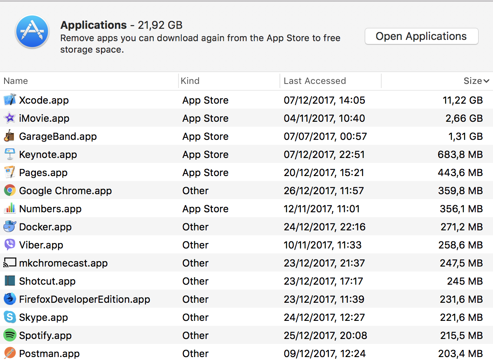

# dtfls
These are the dotfiles [I](https://twitter.com/dentuzhik) use for my personal OSX installation. Some of the things might not work on other systems and will be an overkill for you. If you think that change is generic enough, than submit an issue or (better) pull-request, I would be happy to see them.  

If you find the list of applications not suitable for you, feel free to fork the repo and adjust it the way you see fit.  
Make sure to clone the repo into the root of your home directory, I haven't tested anything with any other setup.

## Install
```
git clone https://github.com/dentuzhik/dotfiles.git
```

## Brew
Homebrew will allow you to preinstall a lot of handy software in a single command.
Install it using the current instructions on the official [Homebrew website](https://brew.sh/).

* After that, go to `~/dotfiles` directory and execute `brew bundle install`
* The total size of resulted `Applications` folder with current config is around **5.4GB**, so make sure you have good internet connection  



## Safari
Copy over Safari Preferences from `./preferences` to `~/Library/Preferences`

## Other Software
[Battery Health 3](https://fiplab.com/apps/battery-health-3-for-mac)
[Pipifier](https://github.com/arnoappenzeller/PiPifier)
[Bear](https://itunes.apple.com/ee/app/bear/id1091189122?mt=12)
[Xcode](https://itunes.apple.com/ee/app/xcode/id497799835?mt=12)

## Alfred 
Alfred is installed using Homebrew in the previous step. Some of the alfred packages are can be found in the global npm installation (below). I manage preferences through cloud file storage, because they contain personal data. 

## Bash
For historical reasons I use Bash, and it solves 100% of my terminal usecases when configured correctly.  

Make sure you have [its latest version](http://clubmate.fi/upgrade-to-bash-4-in-mac-os-x/) used as your shell, because default installation of OSX comes with some super old Bash. You should have a good version of bash installed with Homebrew on a previous step, but make it a default shell using link above.  

## Terminal
* Install the terminal of choice, or use default OSX `Terminal.app`. I have tested these in both, they should work without significant issues.
* Go to `~/dotfiles` directory and execute `./bootstrap.sh`, this will install necessary dependencies into your system and will put the files in the right places
* You are all set!

*P.S. If you are using iTerm, you might want to reimport reasonable preferences for it from `iterm` folder.*
```
# Specify the preferences directory
defaults write com.googlecode.iterm2.plist PrefsCustomFolder -string "~/dotfiles/iterm2"

# Tell iTerm2 to use the custom preferences in the directory
defaults write com.googlecode.iterm2.plist LoadPrefsFromCustomFolder -bool true
```

## Node.js
Node.js versions are managed by [fnm](https://github.com/Schniz/fnm), installed
through Homebrew. The shell automatically selects the version pinned in
`.node-version` when entering this repository. Install it after bootstrapping:

```
fnm install
```

## Language tooling
Install application and language dependencies per project instead of globally.
This keeps versions reviewable in each project's lockfile and avoids exposing
every shell to an unpinned global package set. Python command-line applications
can be installed in isolated environments with `uv tool install`.

## Vim/Neovim
The Neovim configuration targets the current stable Neovim release and uses
the built-in `vim.pack` plugin manager. On first launch, Neovim installs the
plugins recorded in `nvim-pack-lock.json`. Check the installation with:

```
:checkhealth
```

Review and update plugins with `:packupdate`; write the review buffer to accept
an update and refresh the committed lockfile.

## Tmux & Tmuxp
You can find my snowflake `.tmux.conf` in your home folder. When you will run tmux for the first time.
For even further productivity boost, I highly recommend you to have a look at [tmuxp](https://github.com/tony/tmuxp).
Install it in an isolated environment with `uv tool install tmuxp` if needed.

## Github
SSH authentication is handled by the 1Password SSH agent configured in
`.ssh/config`. Create or import a GitHub SSH key in 1Password, enable the SSH
agent, and add the public key to your GitHub account. Then authenticate the
GitHub CLI and verify SSH access:

```
gh auth login --hostname github.com --git-protocol ssh --web
ssh -T git@github.com
```
